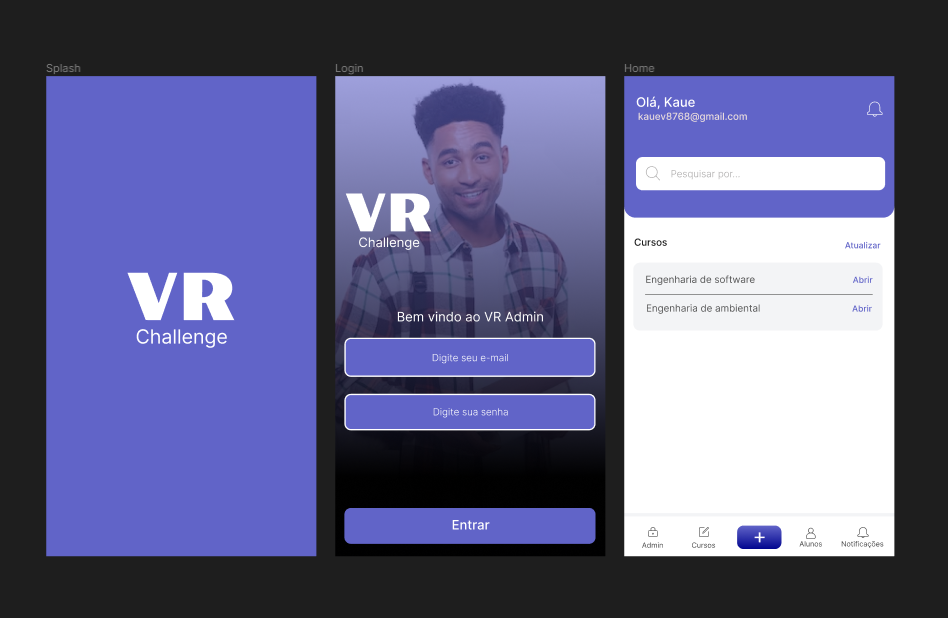

<div align="center">
  
</div>

# VR Challenge

## Sobre o desafio

O desafio consistia em desenvolver uma aplição Flutter utilizando um banco de dados em memória.

Recomendações:

* SQLite
* ObjectBox

## Clonando o projeto 💻

Para rodar o projeto use os seguintes comandos
> O projeto foi desenvolvido para as plataformas Android e IOS, e o banco de dados em memória foi o SQLite.

```bash
# Clonar o repositório
$ git clone https://github.com/KaueSena01/vr_challenge

# Instalar pacotes
$ flutter clean ; flutter pub get
```

## Desing da aplicação 📱

Primeiramente foi desenvolvido um design para a aplicação no [figma](https://www.figma.com/file/Cu3hoo74JaogGkvVarq8kY/Untitled?type=design&node-id=0-1) para facilitar o desenvolvimento do projeto.

<div>
    
</div>

## Executar o projeto 🚀

Antes de rodar o projeto vale ressaltar que ao executá-lo na primeira vez é inserido alguns registros na tabela de curso e aluno para não ser repetitivo o processo de criação de ambos, caso queira desabilitar o preenchimento basta comentar ou remover o código que está em:

> lib/core/configs/db.dart

```
    // Inserting
    for (var course in courses) {
      await db.insert('courses', course);
    }

    for (var student in students) {
      await db.insert('students', student);
    }
```

Para executar o projeto digite:

```bash
flutter run
```

## Pré requisitos ✔

* [x] Flutter
* [x] Banco de dados em memória
* [x] SQLite
* [x] Aplicação modularizada
* [x] MobX
* [x] Versionamento de código

## Adicionais

* [x] Clean Architecture
* [x] Testes

## Desenvolvedor

<table>
  <tr>
    <td align="center">
      <a href="https://github.com/KaueSena01">
        <br>
        <sub>
          <b>Kauê Alves Sena - Mobile Developer 💙</b>
        </sub>
      </a>
    </td>
  </tr>
</table>

Obrigado pela sua atenção.
